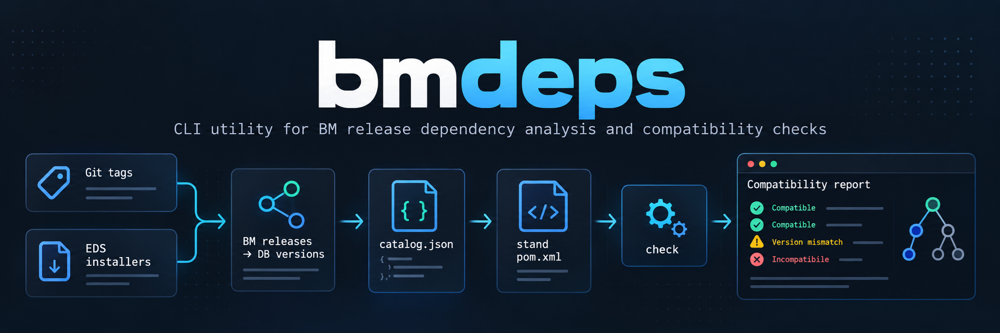

# bmdeps



`bmdeps` is a CLI utility for analyzing dependencies between BM releases and validating whether a selected set of modules can be installed together on a stand.

The utility correlates BM Git tags with database module versions declared in `install.eds`, reads `assert-dependency` requirements, and checks them against the BM versions selected in a stand or builder `pom.xml`.

BM project `pom.xml` files are intentionally not used to determine compatibility. The stand `pom.xml` is used only to determine which BM releases are selected; DB compatibility is derived from EDS installers.

## Features

- scans configured BM repositories in GitLab;
- discovers BM releases from Git tags;
- maps each BM release to its EDS DB version;
- reads DB dependencies from `assert-dependency` declarations;
- supports nested EDS installers such as `version.3700/3710/install.eds`;
- builds a reusable JSON catalog of BM releases and DB requirements;
- generates a Graphviz dependency graph;
- reads BM versions selected in a stand `pom.xml`;
- resolves Maven `${property}` references used for dependency versions;
- validates whether the selected BM releases satisfy EDS DB requirements;
- suggests compatible BM releases when the selected DB version is too old;
- can write a machine-readable JSON compatibility report.

## How it works

`bmdeps` works in two stages.

### 1. Build the release catalog

For every configured BM project, `bmdeps scan`:

1. reads Git tags matching `TAG_REGEX`;
2. treats the Git tag as the BM release version;
3. reads `dataModel/install.eds` from that tag;
4. follows the last active `run /version.<n>/install.eds` entry;
5. if necessary, follows the last active nested numeric installer such as `3710/install.eds`;
6. reads `assert-module-version` to determine the DB module and DB version;
7. reads `assert-dependency` entries to determine required DB versions of other modules;
8. stores the result in `catalog.json`.

For example, a release can be represented internally as:

```text
DPD 2.3.21 -> DPD DB 3710
               requires GLO DB >= 4712
```

### 2. Validate a stand

`bmdeps check` reads the stand or builder `pom.xml` and determines which `cs-*` BM releases are selected.

It then resolves every selected release through `catalog.json`:

```text
stand pom.xml
    |
    +-- cs-dpd 2.3.21 -> DPD DB 3710
    |
    +-- cs-glo 2.6.3  -> GLO DB 4800
```

The EDS requirement from DPD is then checked against the actual DB version provided by the selected GLO release:

```text
DPD 2.3.21 [DB 3710] -> requires GLO DB >= 4712
GLO 2.6.3  [DB 4800] -> satisfies the requirement with a warning
```

## Compatibility rules

`assert-dependency` is treated as a **minimum DB version requirement**.

| Condition | Status | Result |
|---|---|---|
| Actual DB = required DB | `OK` | compatible |
| Actual DB > required DB | `WARNING` | compatible |
| Actual DB < required DB | `MISMATCH` | incompatible |
| Required BM is absent from the stand | `MISSING-MODULE` | incompatible |
| Selected BM release is absent from the catalog | `MISSING-RELEASE` | incompatible |
| `cs-*` module is not represented in the scanned catalog | `UNKNOWN-MODULE` | incompatible |
| The same module/release resolves to several catalog entries | `AMBIGUOUS-RELEASE` | incompatible |

A newer DB version is therefore allowed. For example:

```text
DPD 2.3.21 [DB 3710] -> GLO DB >= 4712
stand has GLO 2.6.3 [DB 4800]
```

This configuration is considered compatible because `4800 >= 4712`, but `bmdeps` reports a warning so that the version difference remains visible.

If the stand contained GLO DB `4700`, the same dependency would be reported as incompatible.

When several modules require different minimum versions of the same DB module, the requirements do not conflict. A DB version that satisfies the highest minimum requirement satisfies the lower requirements as well.

## Getting started

### Requirements

- Go 1.22 or newer;
- access to the GitLab instance containing the BM repositories;
- a GitLab token with read access to the required repositories.

### Build

Clone the repository and enter the project directory:

```bash
git clone <repository-url>
cd bmdeps
```

Build the application:

```bash
go build -o bmdeps .
```

Run tests:

```bash
go test ./...
```

## Configuration

Create a configuration file. The repository contains `.env.example` that can be used as a template:

```bash
cp .env.example bmdeps.env
```

Example:

```env
# GitLab base URL, without /api/v4
GITLAB_URL=https://gitlab.example.com

# Read-only token is enough for private projects
GITLAB_TOKEN=glpat-CHANGE_ME

# BM repositories to scan
PROJECTS=CS-BM/cs-glo,CS-BM/cs-dms,CS-BM/cs-dpd,CS-BM/cs-ped,CS-BM/cs-cm,CS-BM/cs-rm,CS-BM/cs-start

# Release tags to scan
TAG_REGEX=^v?[0-9]+\.[0-9]+\.[0-9]+$

DATA_MODEL_PATH=dataModel
CONCURRENCY=6
HTTP_TIMEOUT=20s
```

Available configuration parameters:

| Variable | Description | Default |
|---|---|---|
| `GITLAB_URL` | GitLab base URL without `/api/v4` | required |
| `GITLAB_TOKEN` | GitLab token used to read tags and repository files | required |
| `PROJECTS` | comma-separated list of BM GitLab projects | required |
| `TAG_REGEX` | regular expression for release tags | `^v?[0-9]+\.[0-9]+\.[0-9]+$` |
| `DATA_MODEL_PATH` | path to the data model directory in a BM repository | `dataModel` |
| `CONCURRENCY` | number of concurrent release scan workers | `6` |
| `HTTP_TIMEOUT` | timeout for GitLab HTTP requests | `20s` |

Real environment variables override values from the configuration file.

## Usage

```text
bmdeps scan  --env ./bmdeps.env --out ./out [--limit 20]
bmdeps list  --catalog ./out/catalog.json [--module glo]
bmdeps check --catalog ./out/catalog.json --pom ./stand_pom.xml [--report ./report.json]
```

### Scan BM releases

Build a catalog from GitLab tags and EDS installers:

```bash
./bmdeps scan --env ./bmdeps.env --out ./out
```

To scan only the newest matching releases of each project:

```bash
./bmdeps scan --env ./bmdeps.env --out ./out --limit 20
```

`--limit` is applied independently to every configured project. `0` means that all matching tags are scanned.

The command creates:

```text
out/
├── catalog.json
└── graph.dot
```

`catalog.json` contains the discovered BM release -> DB version mappings, EDS dependencies, installer paths, and scan errors.

`graph.dot` contains a Graphviz representation of release and DB dependency relationships.

If Graphviz is installed, the graph can be rendered for example with:

```bash
dot -Tpng ./out/graph.dot -o ./out/graph.png
```

### List discovered releases

Show all releases from the catalog:

```bash
./bmdeps list --catalog ./out/catalog.json
```

Filter the output by EDS module:

```bash
./bmdeps list --catalog ./out/catalog.json --module glo
```

Example output:

```text
glo          2.6.3          DB 4800     tag=2.6.3          project=CS-BM/cs-glo
dpd          2.3.21         DB 3710     tag=2.3.21         project=CS-BM/cs-dpd
```

### Check a stand POM

Validate the BM versions selected in a stand or builder `pom.xml`:

```bash
./bmdeps check \
  --catalog ./out/catalog.json \
  --pom ./stand_pom.xml
```

The stand POM may declare versions directly:

```xml
<dependency>
    <groupId>ru.cs</groupId>
    <artifactId>cs-glo</artifactId>
    <version>2.6.3</version>
</dependency>
```

or through Maven properties:

```xml
<properties>
    <engdb.glo.version>2.6.3</engdb.glo.version>
    <engdb.dpd.version>2.3.21</engdb.dpd.version>
</properties>

<dependencies>
    <dependency>
        <groupId>ru.cs</groupId>
        <artifactId>cs-glo</artifactId>
        <version>${engdb.glo.version}</version>
    </dependency>
    <dependency>
        <groupId>ru.cs</groupId>
        <artifactId>cs-dpd</artifactId>
        <version>${engdb.dpd.version}</version>
    </dependency>
</dependencies>
```

`bmdeps` resolves these properties before looking up the selected release in the catalog.

Example compatibility output:

```text
Checking staxel_start 0.1.16

Selected BM releases
MODULE       RELEASE        DB         STATUS
DPD          2.3.21        3710       OK
GLO          2.6.3         4800       OK

EDS dependency checks
! dpd 2.3.21 [DB 3710] -> glo DB >= 4712; stand has glo 2.6.3 [DB 4800]  [WARNING]
  selected release provides newer DB 4800; minimum required DB is 4712

RESULT: COMPATIBLE (WITH WARNINGS)
```

If the selected DB version is lower than required, `bmdeps` reports `MISMATCH` and lists scanned BM releases that provide a sufficient DB version.

### Write a JSON report

The compatibility result can also be written to a JSON file:

```bash
./bmdeps check \
  --catalog ./out/catalog.json \
  --pom ./stand_pom.xml \
  --report ./report.json
```

This is useful for CI/CD integration or for consuming the result from another tool.

### Custom BM artifact prefix

By default, `check` treats `cs-*` dependencies as BM artifacts.

A different prefix can be supplied with `--prefix`:

```bash
./bmdeps check \
  --catalog ./out/catalog.json \
  --pom ./stand_pom.xml \
  --prefix cs-
```

## Available flags

### `scan`

| Flag | Description | Default |
|---|---|---|
| `--env <file>` | path to the configuration file | `./bmdeps.env` |
| `--out <dir>` | output directory | `./out` |
| `--limit <n>` | maximum newest matching tags per project; `0` means all | `0` |

### `list`

| Flag | Description | Default |
|---|---|---|
| `--catalog <file>` | path to `catalog.json` | `./out/catalog.json` |
| `--module <name>` | optional EDS module filter | empty |

### `check`

| Flag | Description | Default |
|---|---|---|
| `--catalog <file>` | path to `catalog.json` | `./out/catalog.json` |
| `--pom <file>` | path to the stand or builder `pom.xml` | required |
| `--prefix <prefix>` | BM Maven artifact prefix | `cs-` |
| `--report <file>` | optional JSON report output path | empty |

## Exit codes

| Code | Meaning |
|---|---|
| `0` | command completed successfully; for `check`, the stand is compatible |
| `1` | runtime, configuration, parsing, GitLab, or file error |
| `2` | invalid CLI usage or an incompatible stand |

A stand that is compatible only with warnings still exits with code `0`.

This makes `bmdeps check` suitable for CI/CD pipelines: an incompatible set of BM versions can fail the pipeline, while a newer-than-required DB version remains allowed.

## Important behavior

### EDS is the source of compatibility information

Compatibility is derived from:

```text
Git tag -> BM release
assert-module-version -> DB version provided by the release
assert-dependency -> minimum required DB version of another module
```

BM repository `pom.xml` files are not used to infer compatibility.

### Stand POM only selects releases

The stand or builder `pom.xml` answers only one question: which BM release is selected for installation.

The selected BM release is then translated to its DB version through `catalog.json`.

### Internal dependencies are ignored

Dependencies pointing to the same DB module, such as an internal DPD DB dependency while analyzing DPD, are not treated as cross-module compatibility checks.

### Unknown `cs-*` dependencies fail validation

If the stand POM contains a dependency with the configured BM prefix but the corresponding module is absent from the scanned catalog, the module is reported as `UNKNOWN-MODULE` instead of being silently ignored.

## Tests

Run all tests with:

```bash
go test ./...
```

The current test suite covers EDS parsing, nested installers, stand POM property resolution, release scanning, lower DB rejection, higher DB warnings, exact DB matches, missing modules, and multiple minimum requirements for the same DB module.
